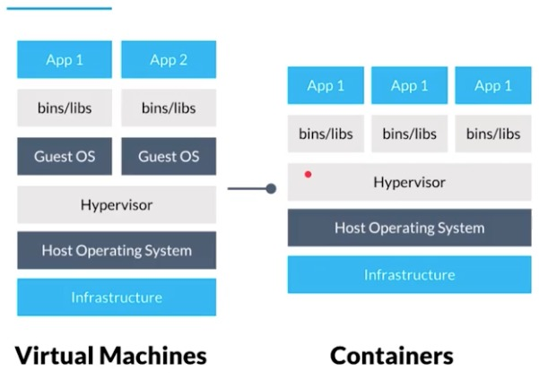

# Curso de Kubernetes (2019)

## 1. Introducción a Kubernetes: conceptos y aplicación práctica

## 2. Repaso de contenedores e introducción a k8s

Contenedores

Los contenedors no son un first class citizen del kernel de Linux (Un contenedor no es una entidad definida previamente por alguien ...) 

Contenedor es un concepto abstracto que se conforma de diferentes tecnologias que potencial las unas a las otras y trabajando en conjutno permiten que esta tencologia sea posible.

Esta compueta de 2 tecnologias.

- cgroups: Permiten que un contenedor o que un proceso tenga aisladas sus recursos de memoria, IO, y CPU.
Permiten decirle al kernel de linux "Quiero que estos 2 procesos o (2 contendores) utilice x cantidad de recursos, " Limitan los recursos del sistema operativo".

- Namespaces: Vistas de los recursos del SO. Permiten aislar (que ese proceso viva en un sandbox y no pueda ve rotros recursos del sistema operativo debajo u otros contenedores) Hay 7 tipos de namespaces 

1. Mount namespace: permite que el proceso tenga una visibilidad reducida de los directorios donde trabaja, las carpetas que monta y sobre las cuales se puede trabajar. Permite que 2 contendores que trabaja sobre un sistema de archivos no se interfieran entre si, y no puedan modificar un archivo de otro.

2. Networking namespace: Permite que cada contenedor tenga su stack de red. interfaz de redm, direccion IP, tabla de rutas y no intefiera con otros contendores.

3. Namespace PID: 

**Pod es una entidad atomica schedulleable**

- Chroot: Permite que cuando se empaquetan las aplicaciones en contenedores. Permite que el proceso tenga visibilida de esos archivos 

Entorno cloud (VMs, containers)

## 3. De pods a contenedores

## 4. ¿Como funciona la arquitectura de red de Kubernetes?

## 5. Modelos declarativos e imperativos

## 6. Visión general del modelo de red

## 7. Recomendación

## 8. Introduccióin a aplicación de prueba

## 9. Instalando nuestro primer cluster con Minikube, Kubeadm

## 10. 

## 11. 
